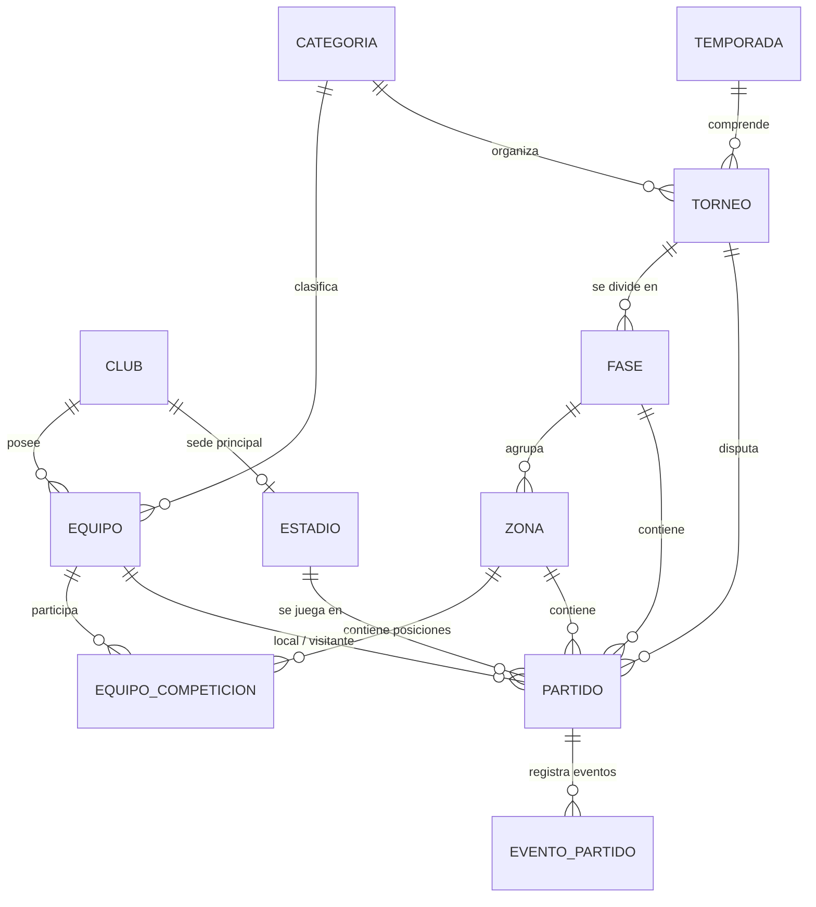

# ⚽ Liga Chivilcoyana de Fútbol – Plataforma Web Oficial & Panel Administrativo

Sistema integral desarrollado en **Laravel 12** y **Tailwind CSS v4** para la gestión y difusión oficial de la **Liga Chivilcoyana de Fútbol** (Chivilcoy, Buenos Aires, Argentina). 

El proyecto centraliza la digitalización de torneos, clubes, equipos, partidos, tablas de posiciones en tiempo real y el control administrativo del certamen en todas sus categorías (Primera División, Reserva e Inferiores).

---

## 🚀 Tecnologías Utilizadas

- **Backend:** [PHP 8.2+](https://www.php.net/) | [Laravel 12.x](https://laravel.com/)
- **Frontend:** [Blade Templates](https://laravel.com/docs/blade) | [Tailwind CSS v4](https://tailwindcss.com/) | [Vite 7](https://vitejs.dev/)
- **Iconos & UI:** [Ionicons](https://ionic.io/ionicons)
- **Base de Datos:** MySQL / SQLite
- **ORM & Arquitectura:** Eloquent ORM, Request Form Validation, Capa de Servicios (`TablaService`)

---

## 🌟 Características Principales

### 🌐 Portal Público
- **Página Principal (Home):**
  - Vista destacada del torneo de Primera División vigente.
  - Tabla de posiciones reducida en tiempo real.
  - Últimos resultados y próximos encuentros programados.
- **Clubes:**
  - Directorio visual con todos los clubes afiliados y sus respectivos escudos.
  - Perfil institucional por club: fecha de fundación, presidente, estadio principal, historia y últimos partidos disputados.
- **Torneos:**
  - Explorador de torneos clasificados por temporada y categoría.
  - Tablas de posiciones detalladas (Puntos, PJ, PG, PE, PP, GF, GC, DIF).
  - Fixtures y cronogramas de fechas por fases y zonas.
- **Partidos:**
  - Seguimiento de partidos programados, en curso y finalizados.
  - Ficha de partido con estadio, fecha, hora, resultado regular y penales.

### ⚙️ Panel de Administración (`/admin`)
- **Dashboard Operativo:** Resumen estadístico en tiempo real (total de torneos activos, partidos programados vs finalizados, clubes y equipos registrados).
- **Gestión de Torneos:**
  - Creación y edición con asignación de categoría, temporada y formato de fase inicial (*Round-Robin*, *Eliminación Directa*, *Ida y Vuelta*).
  - Vinculación automática o manual de clubes y equipos participantes en la competición.
- **Gestión de Partidos:**
  - Programación de encuentros seleccionando torneo, fase, zona y rivales.
  - Asignación inteligente de estadio (toma por defecto la cancha del club local).
  - Carga y actualización de resultados (goles regulares y definición por penales).
- **Gestión de Clubes:**
  - Alta, baja y modificación de instituciones.
  - Carga y actualización de escudos institucionales con almacenamiento en disco (`storage`).
- **Gestión de Equipos:** Registro de equipos por categoría vinculados a sus clubes matriz (ej: Primera, Reserva, "Club B").
- **Motor de Recálculo Automático (`TablaService`):**
  - Al cargar o editar el resultado de un partido finalizado, el sistema recalcula y actualiza automáticamente los puntos, estadísticas y diferencias de gol en las tablas de posiciones.

---

## 🗄️ Modelo de Datos y Arquitectura

El esquema de base de datos modela la estructura de competiciones deportivas:



---

## 📁 Estructura del Proyecto

```text
liga-chivilcoyana-futbol/
├── app/
│   ├── Http/
│   │   ├── Controllers/
│   │   │   ├── Admin/                  # Controladores del panel de administración
│   │   │   │   ├── AdminClubController.php
│   │   │   │   ├── AdminDashboardController.php
│   │   │   │   ├── AdminEquipoController.php
│   │   │   │   ├── AdminPartidoController.php
│   │   │   │   └── AdminTorneoController.php
│   │   │   ├── ClubController.php      # Controladores del portal público
│   │   │   ├── HomeController.php
│   │   │   ├── PartidoController.php
│   │   │   └── TorneoController.php
│   │   └── Requests/Admin/             # Validaciones de formularios (Form Requests)
│   ├── Models/                         # Modelos Eloquent (Club, Torneo, Partido, etc.)
│   └── Services/
│       └── TablaService.php            # Lógica de cálculo de tablas de posiciones
├── database/
│   ├── migrations/                     # Definición de tablas y relaciones
│   └── seeders/                        # Datos iniciales (Clubes de Chivilcoy, Torneos, etc.)
├── resources/
│   ├── css/
│   │   ├── app.css                     # Configuración de Tailwind CSS v4
│   │   └── variables.css               # Variables de tema y colores institucionales
│   ├── js/                             # Scripts de cliente y configuración Vite
│   └── views/
│       ├── admin/                      # Vistas del panel de administración
│       ├── clubes/                     # Vistas públicas de clubes
│       ├── components/                 # Componentes Blade reutilizables
│       ├── home/                       # Vista principal
│       ├── layouts/                    # Plantillas base (Pública y Admin)
│       ├── partials/                   # Encabezados, navegación y pie de página
│       └── torneos/                    # Tablas y fixtures de torneos
└── routes/
    ├── admin.php                       # Rutas del panel administrativo (/admin)
    └── web.php                         # Rutas del portal público
```

---

## ⚙️ Instalación y Puesta en Marcha

### Prerrequisitos
- **PHP** >= 8.2 (con extensiones `pdo`, `mbstring`, `openssl`, `curl`, `fileinfo`)
- **Composer**
- **Node.js** >= 18.x & **NPM**
- **MySQL** o **SQLite**

### Pasos de Instalación

1. **Clonar el repositorio:**
   ```bash
   git clone https://github.com/JosueGaticaOdato/liga-chivilcoyana-futbol.git
   cd liga-chivilcoyana-futbol
   ```

2. **Instalar dependencias de PHP:**
   ```bash
   composer install
   ```

3. **Instalar dependencias de JavaScript y estilos:**
   ```bash
   npm install
   ```

4. **Configurar el archivo de entorno:**
   ```bash
   cp .env.example .env
   php artisan key:generate
   ```

5. **Configurar la base de datos:**
   Asegúrate de configurar los datos de conexión en el archivo `.env` (o utilizar SQLite por defecto). Luego ejecuta las migraciones y los seeders con los datos de prueba de la liga:
   ```bash
   php artisan migrate --seed
   ```

6. **Crear enlace simbólico para imágenes y archivos (`storage`):**
   ```bash
   php artisan storage:link
   ```

7. **Ejecutar el entorno de desarrollo:**

   Puedes iniciar el servidor y los assets en simultáneo con:
   ```bash
   composer dev
   ```
   *O levantando los servicios por separado:*
   ```bash
   # Terminal 1: Servidor PHP
   php artisan serve

   # Terminal 2: Compilador Vite
   npm run dev
   ```

8. **Acceder a la aplicación:**
   - **Sitio Web Público:** [http://127.0.0.1:8000](http://127.0.0.1:8000)
   - **Panel Administrativo:** [http://127.0.0.1:8000/admin](http://127.0.0.1:8000/admin)

---

## 👤 Autor

- **Josue Gatica Odato** - [JosueGaticaOdato](https://github.com/JosueGaticaOdato)